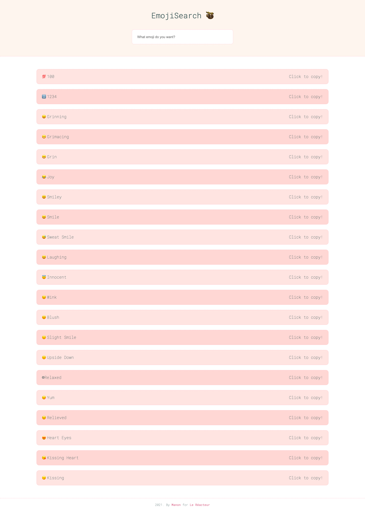
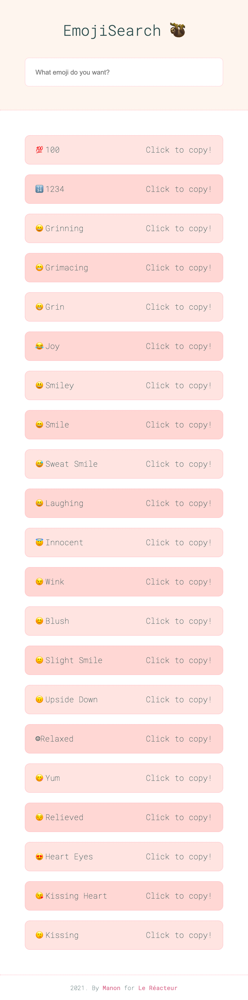

# EMOJIS SEARCH 🥳 🦄 ☀️

🌤 April 2021  
✨ Frontend  
🔗 Netlify - check [that](https://emojissearch-lereacteur-2021.netlify.app/) and test it! 🦦

## 🌈 Overview - Welcome dude

---

Emojis search made at [Le Reacteur](https://www.lereacteur.io/) Bootcamp.  
2 screens are availables: emojis search for web & for mobile.

  

## 👩🏻‍💻 Tasks

---

✘ Create layout  
✘ Build a search bar
✘ Filter emojis  
✘ Copy & paste emojis  
✘ Make responsive design

## 📚 Stacks

---

[Javascript](https://www.w3schools.com/js/default.asp)  
[ReactJS](https://fr.reactjs.org/docs/getting-started.html)  
[HTML5](https://www.w3schools.com/html/default.asp)  
[CSS3](https://www.w3schools.com/css/default.asp)

## 🗝 Installation and usage

---

Be sure, you have installed all dependencies to run the project.

### 🚙 Running the project

1️. Clone this repository

`git clone https://github.com/manon-boiteau/emojis-LeReacteur.git`

`cd emojis-LeReacteur`

2️. Install packages

`npm install`  
or  
`yarn`

3️. When installation is complete:

`yarn start`

🙏🏻 Thank you @LeReacteur.
